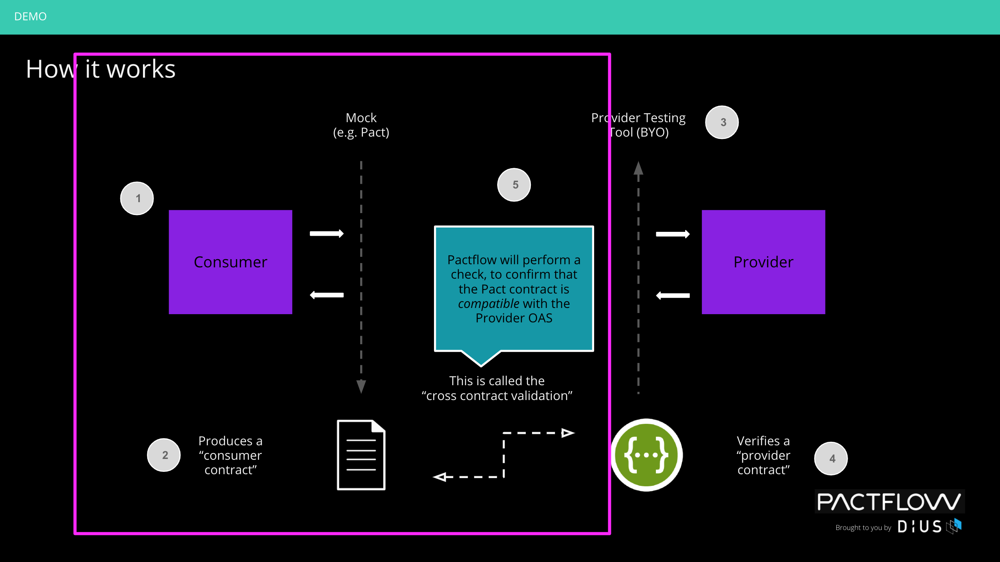
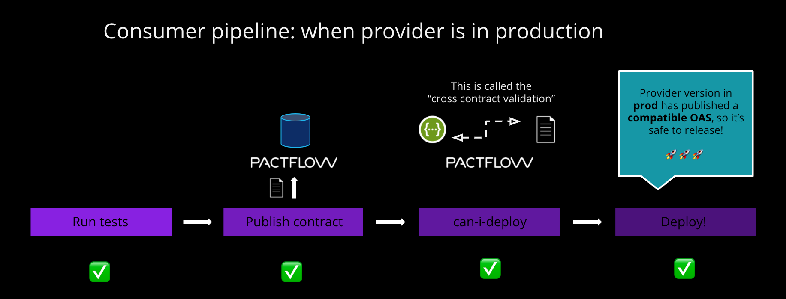

# Example Consumer

 (latest pact)

 (prod/prod pact)

This is an example of a Node consumer using Pact to create a consumer driven contract, and sharing it via [Pactflow](https://pactflow.io).

It is using a public tenant on Pactflow, which you can access [here](https://test.pact.dius.com.au) using the credentials `dXfltyFMgNOFZAxr8io9wJ37iUpY42M`/`O5AIZWxelWbLvqMd8PkAVycBJh2Psyg1`. The latest version of the Example Consumer/Example Provider pact is published [here](https://test.pact.dius.com.au/pacts/provider/pactflow-example-provider/consumer/pactflow-example-consumer/latest).

The project uses a Makefile to simulate a very simple build pipeline with two stages - test and deploy.

* Test
  * Run tests (including the pact tests that generate the contract)
  * Publish pacts, tagging the consumer version with the name of the current branch
  * Check if we are safe to deploy to prod (ie. has the pact content been successfully verified)
* Deploy (only from master)
  * Deploy app (just pretend for the purposes of this example!)
  * Tag the deployed consumer version as 'prod'

## Usage

See the [Pactflow CI/CD Workshop](https://github.com/pactflow/ci-cd-workshop).

## Bi-directional Contracts Feature (BYO Tools)

_NOTE: if you're running the CI/CD workshop, you can ignore this section. This is an extension to the example that demonstrates a new [feature](https://github.com/pactflow/roadmap/issues/4) in developer preview._

This is an example of a Node consumer using Pact to create a consumer driven contract, and sharing it via [Pactflow](https://pactflow.io).

It implements a "Product" website, to demonstrate the new bi-directional contract capability of Pactflow (previously referred to as Provider driven contracts, or collaborative contracts). See the [Provider](https://github.com/pactflow/example-pactflow-example-provider-dredd) counterpart.

It is using a public tenant on Pactflow, which you can access [here](https://test.pact.dius.com.au) using the credentials `dXfltyFMgNOFZAxr8io9wJ37iUpY42M`/`O5AIZWxelWbLvqMd8PkAVycBJh2Psyg1`. The latest version of the Example Consumer/Example Provider pact is published [here](https://test.pact.dius.com.au/pacts/provider/pactflow-example-pactflow-example-provider-dredd/consumer/pactflow-example-consumer/latest).

In the following diagram, you can see how the consumer testing process works - it's the same as the current Pact process! (We do show an alternative using Nock's record/replay functionality)

When we call "can-i-deploy" the cross-contract validation process kicks off on Pactflow, to ensure any consumer consumes a valid subset of the OAS for the provider.

When you run the CI pipeline (see below for doing this), the pipeline should perform the following activities (simplified):

### Pre-requisites

**Software**:

* Tools listed at: https://docs.pactflow.io/docs/workshops/ci-cd/set-up-ci/prerequisites/
* A pactflow.io account with an valid [API token](https://docs.pactflow.io/docs/getting-started/#configuring-your-api-token)

#### Environment variables

To be able to run some of the commands locally, you will need to export the following environment variables into your shell:

* `PACT_BROKER_TOKEN`: a valid [API token](https://docs.pactflow.io/docs/getting-started/#configuring-your-api-token) for Pactflow
* `PACT_BROKER_BASE_URL`: a fully qualified domain name with protocol to your pact broker e.g. https://testdemo.pactflow.io
* `PACT_PROVIDER=pactflow-example-provider-dredd`: this changes the default provider to the Dredd based provider (https://github.com/pactflow/example-provider-dredd)
* `PACT_PROVIDER=pactflow-example-provider-postman`: ... Postman (https://github.com/pactflow/example-provider-postman)
* `PACT_PROVIDER=pactflow-example-provider-restassured`: ... Rest Assured (https://github.com/pactflow/example-provider-restassured)
### Usage

#### Pact use case

* `make test` - run the pact test locally
* `make fake_ci` - run the CI process locally

#### BYO Tool use case with Nock (record/replay example)

NOTE: The nock recordings are already in the project, in the `./fixtures` directory, see below for how to obtain these recordings.

* `make clean` - ensure previous pacts are cleared
* `make test_nock` - run the nock test locally
* `make fake_ci_nock` - run the nock version of the CI process locally

*Re-record nock fixtures*

You first need to start up the provider API in order to obtain nock recordings. The API must be running on `http://localhost:3000` for this step to work.

For the default [Provider](https://github.com/pactflow/example-pactflow-example-provider-dredd) designed for this workshop, you can simply start it up by running `npm start` in the root directory of the provider project, as per its README.

* `npm run test:record` - this will run nock in record mode, and your api client will issue real requests to the API
* `npm run test:nock` - run the nock tests in replay only mode, validating all stubs were used in the process, and writing a pact file if successful